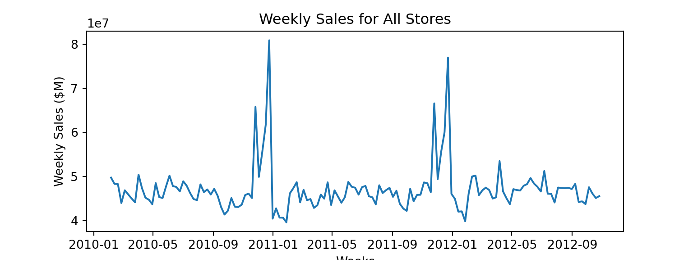
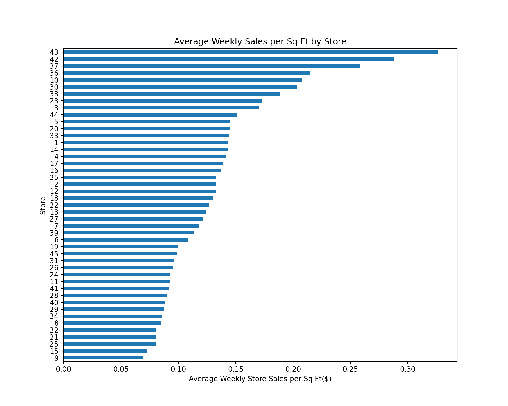

# **Store Sales Forecasting Project**

### **Problem Statement**
During my 12 week data science bootcamp, we delved into time series modeling. Post-graduation, seeking to apply my skills to retail, I aimed to forecast a store's future sales. I discovered a Kaggle dataset used by Walmart for recruiting in 2014, containing 30 months of historical weekly sales data from 45 stores. The project's goal was to analyze the dataset, extract insights on store performance from historical data and use advanced time series models like SARIMAX and Prophet for Walmart's future sales predictions.

### **Data Overview and Visualization**
The dataset used in this project came from the [Walmart Recruiting - Store Sales Forecasting Kaggle (2014)](https://www.kaggle.com/competitions/walmart-recruiting-store-sales-forecasting/overview), which has historical sales data for 45 Walmart stores located in different regions.

The data was pretty clean, but I needed to merge the three datasets into one and then apply specific preprocessing techniques including converting date to datetime object, filling in / removing NA values and dummifying certain variables. I then went into EDA to explore the data and extract key historical insights.

First, I aggregated total weekly sales (for all 45 Walmart locations) to look at overall trends. We can see large spikes around the holidays in November/December.
 
 
 

Time series decomposition is a statistical technique that involves breaking down a time series into its underlying components to better understand its patterns and improve forecasting accuracy. The most common components of a time series are trend, seasonality, and remainder. Shown below, we can also decompose these sales numbers into trend, seasonal and residuals. Spikes can be observed around the holidays.
 
 

Below we can see average weekly sales. Store 20 is the store with the highest revenue, averaging almost \\$30K per week, with Store 5 being the smallest, averaging just \\$5K per week.    
 

Below we can see average weekly sales per square foot. Store 43 was the most efficient store, selling over \\$0.30 per square foot per week, with Store 9 being the least efficient, selling just \\$0.07 per square foot per week.    

Below, we can also see the autocorrelation and partial autocorrelations of the total weekly sales data. Autocorrelation (ACF) and partial autocorrelation (PACF) are statistical metrics employed in time series analysis to examine the association between a given time series and its past values. Autocorrelation assesses the correlation between a data point and its preceding values at different time lags, aiding in the identification of recurring patterns or cycles within the data. Partial autocorrelation, while also gauging the direct relationship between two time points, adjusts for the influence of intermediary data points. It plays a crucial role in determining the autoregressive component's order in a time series model. Peaks beyond the confidence interval in the partial autocorrelation function suggest potential lag orders relevant for an AR model.
 
 

### **XGBoost Model**
XGBoost, or eXtreme Gradient Boosting, is a machine learning algorithm widely recognized for its efficacy in diverse predictive modeling scenarios. As a part of the ensemble learning category, XGBoost leverages gradient boosting, a technique wherein a series of sequentially trained weak learners, typically decision trees, iteratively correct errors made by their predecessors. Decision trees serve as the fundamental building blocks, recursively splitting the data based on features to make decisions at each node. To prevent overfitting, XGBoost incorporates regularization terms in its objective function, controlling the complexity of individual trees. The model is trained through a gradient descent optimization algorithm, progressively adding new trees at each iteration to minimize residuals. XGBoost provides insights into feature importance, facilitates parallel and distributed computing for efficiency, and employs tree pruning techniques to enhance model compactness and efficiency. XGBoost models  have high predictive performance, speed and adaptability.

An XGBoost model was run on the data, utilizing RandomSearchCV to tune the hyperparameters and optimize performance. The best set of hyperparameters was 'subsample': 0.7, 'n_estimators': 500, max_depth': 10, 'learning_rate': 0.1, 'colsample_bytree': 0.5, 'colsample_bylevel': 0.6. Below we can see a figure showing the top 10 most significant features. Feature significance refers to the importance or contribution of individual features (variables) in a predictive model in determining the output or target variable. Unsurprisngly, size, department and store type are the 3 most significant features in predicting a store's sales.  
 

The final XGBoost model had an R-Squared score of 0.81, and actual (shown in blue) vs. forecasted (shown in orange) performance is shown below. The model was quite good at predicting the sales spikes associated with the holidays and the general seasonality, but generally seemed to underestimate overall sales. 
 
 

### **Prophet Model**
Prophet, developed by Facebook, is a specialized forecasting tool designed for time series analysis. Tailored for scenarios with regular observations featuring patterns across various time scales, including holidays and special events, Prophet is particularly adept at forecasting future values. Its core components include an additive decomposition of time series data into trend, seasonality, and holiday effects. Noteworthy features of Prophet include its automatic detection of seasonality, the ability to incorporate information about holidays, and a user-friendly design, making it accessible for users with varying levels of expertise in time series forecasting. Additionally, Prophet exhibits resilience to missing data and outliers and is scalable for efficient handling of large datasets. The model's simplicity and effectiveness make it suitable for diverse applications, and make it a good fit for this application.

A Prophet model was run on the data, adding regressors for predictive variables such as temperature, fuel price, department and store size. Below we can see some of the components of the Prophet model mentioned above. Notably, we can see the model picked up on the large spike in sales towards the end of November through the end of the year. 
 
 

The final Prophet model had an R-Squared score of 0.97, and forecasted weekly sales with less than a 6% margin of error. The actual sales (shown in blue) vs. forecasted sales (shown in orange) performance is shown below. This model was the most accurate, as it picked up on both trends/seasonality as well as magnitude of trends. 
 

### **SARIMAX Model**
The SARIMAX (Seasonal AutoRegressive Integrated Moving Average with eXogenous factors) represents an advanced approach to time series forecasting, building upon the capabilities of the ARIMA model. It integrates crucial components to comprehensively capture patterns within time series data, including the AutoRegressive (AR), Integrated (I), and Moving Average (MA) components for non-seasonal dynamics, the Seasonal component to address recurring patterns, and the eXogenous (X) Factors component to account for external influences. These components collectively contribute to a sophisticated framework that accommodates intricate temporal dependencies and external factors. SARIMAX is parameterized by specific orders for each component, and its parameters are estimated through historical time series data. The model's flexibility, particularly in accommodating exogenous variables, makes it a valuable tool for forecasting tasks.

In order to use SARIMA we will need to choose p,d,q values for the ARIMA, and P,D,Q values for the Seasonal component. An Auto ARIMA was used, where the model itself generated the optimal p, d, and q values. The final model used was `ARIMA(2,0,2)(1,0,0)[52]`. In this model, `p=2` representing the order of the AutoRegressive (AR) component, `d=0` signifying the order of differencing applied to make the time series stationary, `q=2` denotes the order of the Moving Average (MA) component. The number 52 suggests a seasonal pattern with a period of 52 time units (weeks in a year). Shown below is the actual sales (shown in blue) vs. forecasted sales (shown in orange).
 

